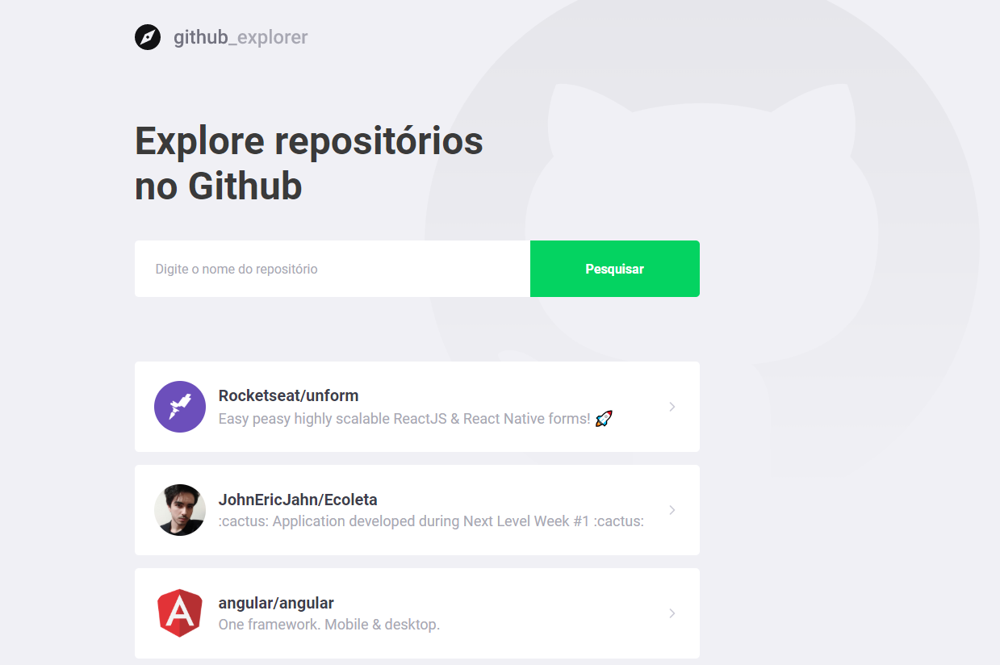
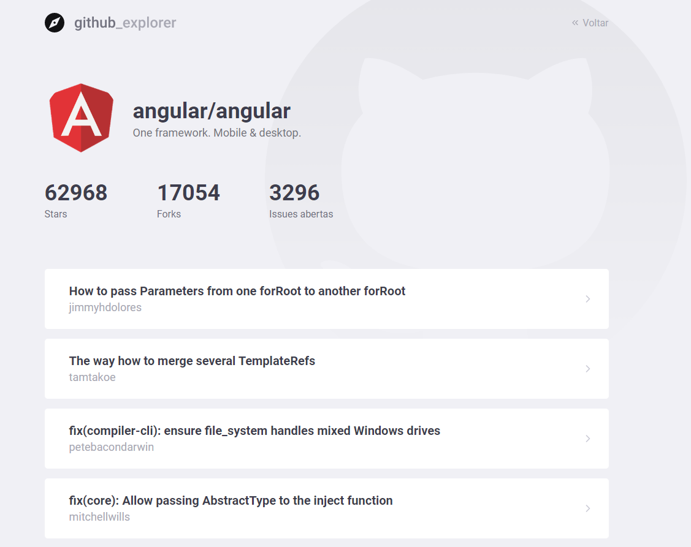

<br>

<p align="center">
  <a>
    
  </a>
</p>

<h2 align="center">:octocat: Explore Amazing Github Repositories :octocat:</h2>

<p align="center">	
  <a href="www.linkedin.com/in/john-eric-jahn">
    
  </a>
  
  </a>
</p>

<p align="center">
  <a href="#-features">Features</a>&nbsp;&nbsp;&nbsp;|&nbsp;&nbsp;&nbsp;
  <a href="#-layout">Layout</a>&nbsp;&nbsp;&nbsp;|&nbsp;&nbsp;&nbsp;
  <a href="#rocket-Technologies">Technologies</a>&nbsp;&nbsp;&nbsp;|&nbsp;&nbsp;&nbsp;
  <a href="#information_source-how-to-use">How to use</a>&nbsp;&nbsp;&nbsp;|&nbsp;&nbsp;&nbsp;
  <a href="#page_with_curl-licença">License</a>&nbsp;&nbsp;&nbsp;|&nbsp;&nbsp;&nbsp;
</p>

## 💻 Features
A list of things you can do with this project.

* Explore for github repositories and add them to your list
* View the list of issues of a repository
* View the list of forks of a repository
* View the list of stargazers of a repository

## 🔖 Layout

<p align="center">
  
  
</p>

## :rocket: Technologies

This project was developed with the following technologies:

* **[React][react]**
* **[TypeScript][typescript]**
* **[React Router Dom][react_router_dom]**
* **[React Icons][react_icons]**
* **[Axios][axios]**
* **[Styled Components][styled-components]**

## :information_source: How To Use

Run the following scripts in order to execute the application in development mode 

```
  git clone https://github.com/JohnEricJahn/GitHub-Explorer
  yarn install
  yarn start
```

## :page_with_curl: LICENÇA

Esse repositório está licenciado pela **MIT LICENSE**.

[react]: https://reactjs.org/
[typescript]: https://www.typescriptlang.org/
[react_router_dom]: https://github.com/ReactTraining/react-router/tree/master/packages/react-router-dom
[react_icons]: https://react-icons.github.io/react-icons/
[axios]: https://github.com/axios/axios
[styled-components]: https://styled-components.com/docs/basics
